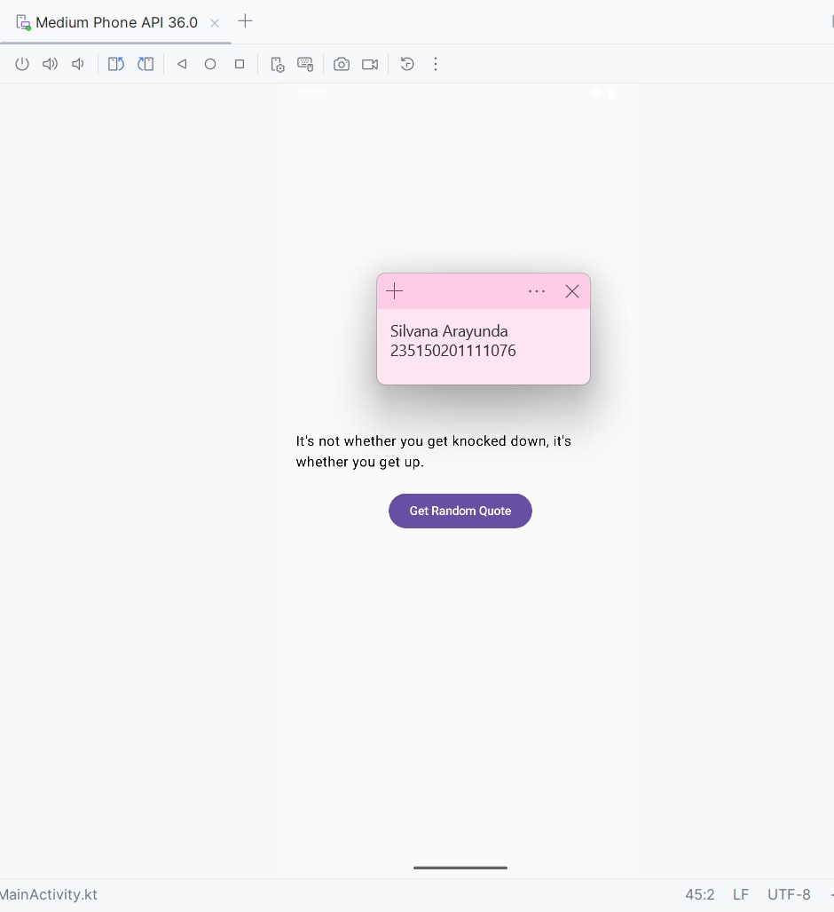

# 📱 Random Quote Generator - Kotlin Coroutines

Aplikasi Android sederhana untuk mempelajari implementasi **Kotlin Coroutines** dalam pengembangan aplikasi Android modern menggunakan Jetpack Compose.

## 📖 Deskripsi

Aplikasi ini menampilkan kutipan motivasi secara random dengan simulasi network delay menggunakan coroutines. Dibuat sebagai praktikum untuk memahami konsep asynchronous programming di Android.

## ✨ Fitur

- ✅ Menampilkan quote random dari list
- ✅ Loading indicator saat mengambil data
- ✅ UI tetap responsive dengan coroutines
- ✅ Modern UI menggunakan Jetpack Compose
- ✅ State management dengan StateFlow

## 🛠️ Teknologi yang Digunakan

- **Kotlin** - Bahasa pemrograman
- **Jetpack Compose** - Modern UI toolkit
- **Coroutines** - Asynchronous programming
- **ViewModel** - Lifecycle-aware component
- **StateFlow** - Reactive state holder

## 📂 Struktur Project
```
com.example.coroutinesdemo/
├── MainActivity.kt          # UI layer dengan Compose
├── QuoteViewModel.kt        # Business logic & state management
└── QuoteRepository.kt       # Data layer
```

## 🚀 Cara Menjalankan

1. Clone repository ini:
```bash
   git clone https://github.com/silvanarayunda96/CoroutinesDemo.git
```

2. Buka project di Android Studio

3. Sync Gradle dan tunggu sampai selesai

4. Run aplikasi di emulator atau device fisik

## 📸 Screenshot


*Tampilan aplikasi Random Quote Generator*

## 🎓 Konsep yang Dipelajari

### 1. **Coroutines**
- Menjalankan operasi asynchronous tanpa blocking UI
- Penggunaan `suspend fun` dan `delay()`

### 2. **Scope Management**
- `viewModelScope` - otomatis cancel saat ViewModel destroyed
- Lifecycle-aware coroutine execution

### 3. **State Management**
- `StateFlow` untuk reactive data
- `collectAsState()` untuk observe perubahan di Compose

### 4. **Architecture Components**
- ViewModel untuk memisahkan business logic
- Repository pattern untuk data layer

## 📝 Eksplorasi & Pembelajaran

### Pertanyaan yang Dijawab:

1. **delay() vs Thread.sleep()** - Perbedaan blocking vs non-blocking
2. **viewModelScope vs GlobalScope** - Lifecycle management
3. **Dispatchers** - Threading di coroutines
4. **Loading State** - Pentingnya user feedback
5. **Observable Pattern** - StateFlow vs variabel biasa
6. **Sequential Operations** - Dampak pemanggilan berurutan
7. **Error Handling** - Try-catch di coroutines

## 📋 Dependencies
```gradle
dependencies {
    // Lifecycle & ViewModel
    implementation("androidx.lifecycle:lifecycle-viewmodel-compose:2.6.2")
    
    // Coroutines
    implementation("org.jetbrains.kotlinx:kotlinx-coroutines-android:1.7.3")
}
